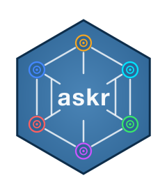

<div align="center">

</div>

# askr

<!-- badges: start -->


[](LICENSE)

<!-- badges: end -->

> Ask AI from R — and get an answer.

`askr` is an R package for querying Large Language Models hosted on **Azure OpenAI** and **Azure AI Foundry** directly from R. It provides a clean, unified interface for researchers, data scientists, and analysts — without dealing with API plumbing or authentication logic.

> **Note:** This package requires an Azure subscription with the relevant models deployed.
> It does **not** work with `api.openai.com` (plain OpenAI) or any other provider directly.

---

## For Researchers and Analysts

If you want to use `askr` to analyse text, summarise transcripts, or generate insights — this section is for you.

### Step 1 — Install

```r
# install.packages("devtools")  # if not needed
devtools::install_github("leadership-research/askr")
library(askr)
```

Or clone and install locally:

```bash
git clone https://github.com/leadership-research/askr.git
```

```r
devtools::install_local("path/to/askr")
library(askr)
```

### Step 2 — Configure

Add these to your `~/.Renviron` file, then **restart R**:

```
API_KEY=your-azure-api-token
ASKR_OPENAI_BASE=https://your-resource.cognitiveservices.azure.com
ASKR_OSS_BASE=https://your-resource.services.ai.azure.com
```

Contact your administrator for the API key and endpoint URLs.

### Step 3 — Ask

```r
library(askr)

response <- ask(
  prompt = "Summarise the key leadership themes in this transcript: [transcript]",
  model  = "mistral"
)

cat(response)
```

Use a domain-specific system prompt for better results:

```r
response <- ask(
  prompt        = "Identify the three main leadership themes in this text: [text]",
  model         = "mistral",
  system_prompt = "You are an expert in organisational psychology and leadership development."
)
```

### What you can do with `ask()`

- Summarise interview transcripts
- Extract themes from survey responses
- Draft reports from qualitative data
- Generate reflective insights
- Answer research questions using document text

If something goes wrong, `ask()` returns a readable error string beginning with `[ask() error]` — it never crashes your pipeline.

### Available models

```r
list_available_models()
#> [1] "mistral" "gpt-4o" "gpt-5" "llama4" "phi4" "deepseek_r1"
```

### PII notice

**Do not send raw personally identifiable information as a prompt.** Prompts are transmitted to an external Azure endpoint. De-identify transcripts and survey responses before passing them to `ask()`. See the [Getting Started vignette](vignettes/getting-started.Rmd) for guidance.

---

## For Developers and Maintainers

This section covers advanced usage, configuration, and package internals.

### Environment variables

| Variable           | Required | Default              | Description                                |
| ------------------ | -------- | -------------------- | ------------------------------------------ |
| `API_KEY`          | Yes      | —                    | Azure API token                            |
| `ASKR_OPENAI_BASE` | Yes      | —                    | Base URL for Azure OpenAI (GPT models)     |
| `ASKR_OSS_BASE`    | Yes      | —                    | Base URL for Azure AI Foundry (OSS models) |
| `ASKR_OPENAI_VER`  | No       | `2025-01-01-preview` | Azure OpenAI API version                   |
| `ASKR_OSS_VER`     | No       | `2024-05-01-preview` | Azure AI Foundry API version               |

> **Important:** Environment variables are read when the package loads (`library(askr)`). Set them in `~/.Renviron` before starting R, or in `.Renviron` in your project root. Calling `Sys.setenv()` after `library(askr)` has no effect on the endpoint constants — only `API_KEY` is read at call time.

### Low-level API: `ask_raw()`

Returns a structured `askr_response` object with `ok`, `status`, `model`, and `response` fields — useful for programmatic control, pipelines, and debugging:

```r
res <- ask_raw(
  query         = "Summarize the leadership challenges in this transcript:\n\n[transcript]",
  model         = "mistral",
  temperature   = 0.5,
  system_prompt = "You are an expert leadership coach.",
  extra_params  = list(max_tokens = 1024L)
)

if (res$ok) {
  cat(res$response)
} else {
  message("HTTP ", res$status, ": ", res$response)
}

print(res)               # truncated at 500 chars by default
print(res, max_chars = Inf)  # full response
```

### Function reference

| Function                  | Description                                                                             |
| ------------------------- | --------------------------------------------------------------------------------------- |
| `ask()`                   | High-level helper — returns plain text or a formatted error string. Never stops.        |
| `ask_raw()`               | Low-level interface — returns `askr_response` with `ok`, `status`, `model`, `response`. |
| `list_available_models()` | Lists enabled model aliases from the registry.                                          |

### Model registry

The registry lives at `inst/config/models.json`. Each entry:

```json
{
  "alias": "mistral",
  "engine": "mistral-medium-2505",
  "provider": "mistral",
  "enabled": true
}
```

`provider = "openai"` routes to the Azure OpenAI deployment endpoint. All other providers route to the Azure AI Foundry serverless endpoint.

### Running tests

```r
devtools::test()
```

104 tests across 5 files. All HTTP calls are mocked — no live credentials needed to run the suite.

### CI

| Workflow       | Trigger        | What it does                                    |
| -------------- | -------------- | ----------------------------------------------- |
| `pkgdown.yaml` | Push to `main` | Builds and deploys pkgdown site to GitHub Pages |

Both workflows run a gitleaks secret scan before any deployment step.

### Documentation

- **Vignettes:** `vignettes/getting-started.Rmd`, `vignettes/architecture-overview.Rmd`
- **Reference docs:** generated from roxygen2 — run `devtools::document()` after editing `R/`
- **pkgdown site:** `docs/` — built by CI, do not edit manually

---

## License

Licensed under the [Apache License 2.0](LICENSE).

Copyright 2025 the askr authors. You are free to use, modify, and distribute this package under the terms of the Apache 2.0 license. See `LICENSE` for the full text.
