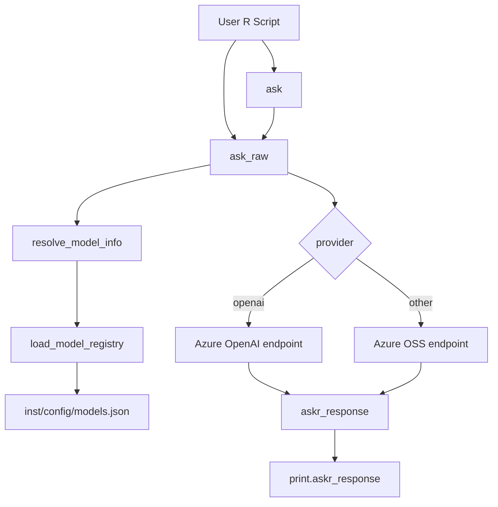

# Architecture

This document explains package internals and runtime flow.

## Architectural Style

`askr` is a thin client wrapper around Azure-hosted LLM endpoints.

- Registry-driven model resolution.
- Provider-based endpoint routing.
- Two API layers: human-friendly (`ask`) and structured (`ask_raw`).

## Component Diagram

## Runtime Request Flow

1. Caller invokes `ask()` or `ask_raw()`.
2. Input validation runs.
3. `API_KEY` is read from environment.
4. Model alias/engine resolves via registry.
5. Endpoint URL is selected by provider.
6. Unified chat payload is sent using `httr::POST`.
7. HTTP response is parsed into `askr_response`.
8. `ask()` unwraps to plain text; `ask_raw()` returns full structure.

## Data Contracts

### Model Registry Contract

Each row in `models.json` must include:

- `alias`: friendly model name
- `engine`: deployment/model identifier
- `provider`: routing key (`openai` or other)
- `enabled`: boolean usage flag

### Response Contract

`askr_response` object includes:

- `ok`
- `status`
- `model`
- `response`

## Error Handling Model

- Input errors: immediate `stop()`.
- Missing credentials: immediate `stop()` in `ask_raw()`.
- Network errors: caught and returned as `askr_response` with `ok = FALSE`.
- Non-200 responses: returned with raw error text and status code.

## Extension Points

- Add or disable models in `inst/config/models.json`.
- Update endpoint/version constants in `R/constants.R` when infrastructure changes.
- Extend response parsing if upstream payload shape changes.

## Non-Goals (Current Design)

- No streaming token support.
- No built-in retry/backoff logic.
- No per-request custom endpoint override.
