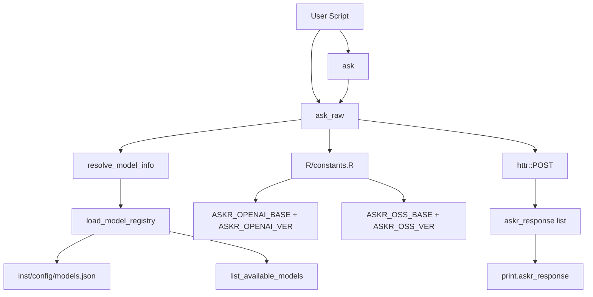
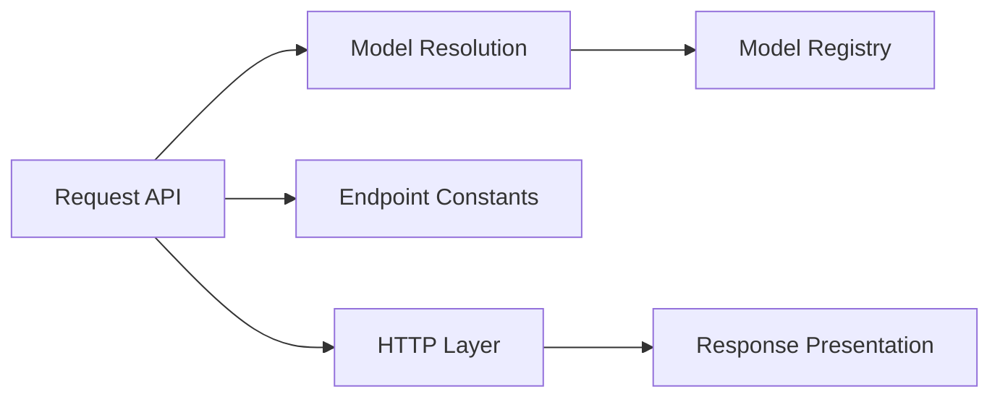
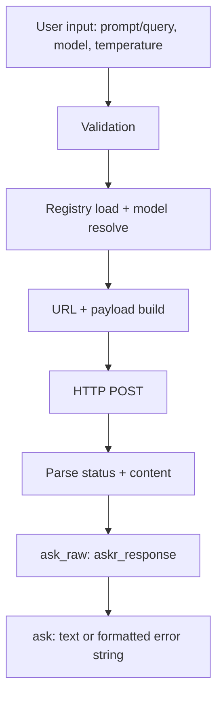

# askr Engineering Documentation

## 1. Executive Technical Overview

`askr` is an R package that provides a lightweight interface for sending chat-completion style requests to Azure-hosted large language models (LLMs).

It solves the problem of repetitive API plumbing in R scripts by centralizing:

- model selection via alias-based registry configuration,
- endpoint routing by provider type,
- standardized request payload construction,
- uniform response/error handling.

Intended audience:

- analysts and researchers using LLMs in R workflows,
- R developers integrating AI calls into scripts/pipelines,
- maintainers who need to update model mappings/endpoints.

Key features in current implementation:

- `ask()` for text-first, interactive usage,
- `ask_raw()` for structured programmatic responses,
- JSON model registry (`inst/config/models.json`) with enable/disable flags,
- model discovery/resolution helpers,
- S3 print method for low-level response objects.

Design philosophy observed from code:

- thin wrapper over HTTP endpoints,
- explicit validation for user-facing parameters,
- minimal dependencies (`httr`, `jsonlite`),
- configuration-driven model routing.

Position in R ecosystem:

- follows package structure conventions (`DESCRIPTION`, `NAMESPACE`, `R/`, `man/`, `inst/`),
- uses roxygen2-generated namespace/manual files,
- compatible with `devtools` workflows,
- currently pre-CRAN-hardening (missing tests/vignettes/CI/NEWS at this time).

## 2. Package Architecture Overview

### Main components

- API layer: `ask()`, `ask_raw()`.
- Model configuration layer: `load_model_registry()`, JSON registry file.
- Model resolution layer: `resolve_model_info()`, `resolve_model()`.
- Discovery layer: `list_available_models()`.
- Output presentation layer: `print.askr_response()`.
- Infrastructure constants: endpoint/version constants in `R/constants.R`.

### Exported vs internal

- Exported functions are defined in `NAMESPACE`.
- Endpoint/version constants are documented with `@keywords internal` but exposed as package objects in current build (`man/ASKR_OPENAI_BASE.Rd` exists).

### Interaction summary

- `ask()` delegates to `ask_raw()`.
- `ask_raw()` depends on model resolution and constants.
- resolution functions depend on registry loading.

### Architecture diagram



## 3. Directory and File Structure

### Observed repository structure

- `R/` present.
- `man/` present.
- `inst/config/` present.
- `tests/`, `vignettes/`, `data/`, `tools/`, `pkgdown/`, `.github/` not present.

### Standard directory purpose (and current status)

- `R/`: package source functions (present, primary logic).
- `tests/`: automated tests (not present).
- `man/`: generated Rd docs (present).
- `vignettes/`: long-form user docs (not present).
- `inst/`: installed auxiliary files (present, includes model registry JSON).
- `data/`: packaged datasets (not present).
- `tools/`: maintainer scripts (not present).
- `pkgdown/`: static site config (not present).
- `.github/`: CI and repo automation (not present).

### Key files table

| File | Role |
|---|---|
| `DESCRIPTION` | Package metadata, dependencies, version, license |
| `NAMESPACE` | Export/import declarations generated by roxygen2 |
| `R/ask.R` | High-level API wrapper returning text |
| `R/ask_raw.R` | HTTP request/response core implementation |
| `R/model_registry.R` | Registry loading and schema/type normalization |
| `R/resolve_model.R` | Alias/engine resolution helpers |
| `R/list_available_models.R` | Enabled model discovery |
| `R/print_askr_response.R` | S3 print method for response object |
| `R/constants.R` | Endpoint and API-version constants |
| `inst/config/models.json` | Runtime model mapping/configuration |
| `README.md` | User-facing intro and quickstart |
| `man/*.Rd` | Generated function documentation |

## 4. DESCRIPTION File Analysis

Current metadata highlights:

- Package: `askr`
- Version: `0.1.0`
- Depends: `R (>= 4.2.0)`
- Imports: `httr`, `jsonlite`
- Suggests: `testthat (>= 3.0.0)`
- License: `file LICENSE`
- Roxygen enabled with markdown.

Dependency rationale (from code):

- `httr`: `POST`, headers, status parsing, response content extraction.
- `jsonlite`: JSON serialization (`toJSON`) and registry loading (`fromJSON`).
- `testthat` in Suggests: indicates intent to support testing, but no tests are currently committed.

Versioning and maturity inference:

- `0.1.0` indicates early-stage package with usable core API but incomplete engineering scaffolding (tests/CI/vignettes absent).

## 5. Namespace and API Design

### Exported functions (from `NAMESPACE`)

- `ask`
- `ask_raw`
- `list_available_models`
- `load_model_registry`
- `resolve_model`
- `resolve_model_info`
- S3 method `print.askr_response`

### Imports

- `httr::POST`, `httr::add_headers`, `httr::content`, `httr::status_code`
- `jsonlite::fromJSON`, `jsonlite::toJSON`

### API structure

- Human-friendly API: `ask()`.
- Programmatic API: `ask_raw()`.
- Configuration and discoverability API: model registry/resolution/listing helpers.

### Object system usage

- Uses S3 only for printing `askr_response` objects.
- No S4 or R6 classes present.

### Categorized exported function list

- Request execution: `ask()`, `ask_raw()`
- Model config/discovery: `load_model_registry()`, `list_available_models()`, `resolve_model_info()`, `resolve_model()`
- Presentation: `print.askr_response()`

## 6. Functional Modules

### Module A: Request API

- Purpose: user entry points for making prompts.
- Functions: `ask()`, `ask_raw()`.
- Input: prompt/query string, model identifier, temperature.
- Output: plain text (`ask`) or structured list (`ask_raw`).

### Module B: Model Registry

- Purpose: load/validate/normalize model definitions.
- Functions: `load_model_registry()`.
- Input: none (reads installed registry file).
- Output: data.frame with `alias`, `engine`, `provider`, `enabled`.

### Module C: Model Resolution

- Purpose: map user model names to deployment metadata.
- Functions: `resolve_model_info()`, `resolve_model()`.
- Input: alias or engine string.
- Output: engine/provider list or engine string.

### Module D: Response Presentation

- Purpose: standardized human-readable display of low-level response object.
- Functions: `print.askr_response()`.

### Module interaction diagram



## 7. Function-Level Documentation

### `ask(prompt, model, temperature = 0.7)`

- Purpose: convenience wrapper for interactive use.
- Parameters:
  - `prompt`: non-empty character scalar.
  - `model`: alias/engine string.
  - `temperature`: numeric scalar.
- Return:
  - success: model text.
  - failure: formatted string beginning with `[ask() error]`.
- Side effects: network call via delegated `ask_raw()`.
- Error conditions:
  - invalid/empty prompt -> `stop()`.
  - downstream errors handled as formatted return string.
- Example:

```r
ask("Explain supervised learning in one paragraph.", model = "gpt-4o", temperature = 0.4)
```

### `ask_raw(query, model, temperature = 0.7)`

- Purpose: low-level API call with status/metadata.
- Parameters:
  - `query`: non-empty character scalar.
  - `model`: non-empty character scalar.
  - `temperature`: numeric scalar.
- Return: S3 object `askr_response` list: `ok`, `status`, `model`, `response`.
- Side effects:
  - reads env var `API_KEY`.
  - performs HTTP POST request.
- Error conditions:
  - invalid arguments -> `stop()`.
  - missing `API_KEY` -> `stop()`.
  - network failures -> returned object with `ok = FALSE`, `status = NA`.
  - HTTP non-200 -> returned object with raw error text.
- Example:

```r
res <- ask_raw("Summarize this text.", model = "mistral", temperature = 0.3)
if (res$ok) cat(res$response)
```

### `load_model_registry()`

- Purpose: load and minimally normalize model registry JSON.
- Return: data.frame with required columns.
- Error conditions:
  - file missing,
  - missing required columns.

### `resolve_model_info(model_name)`

- Purpose: resolve alias or engine among enabled models.
- Return: list with `engine` and `provider`.
- Error conditions:
  - invalid input,
  - no enabled models,
  - no unique hit.

### `list_available_models()`

- Purpose: list enabled aliases (fallback to engine if alias empty).
- Return: character vector; may return `character(0)` with informational message.

### `print.askr_response(x, ...)`

- Purpose: S3 print method for low-level response object.
- Return: invisibly returns input object.

## 8. Data Structures and Object Models

### Registry data.frame

Produced by `load_model_registry()` with required columns:

- `alias` (character)
- `engine` (character)
- `provider` (character, normalized lowercase)
- `enabled` (logical, normalized from common truthy/falsy strings)

Example structure:

```r
data.frame(
  alias = c("gpt-4o", "mistral"),
  engine = c("gpt-4o", "mistral-medium-2505"),
  provider = c("openai", "mistral"),
  enabled = c(TRUE, TRUE)
)
```

### `askr_response` S3 object

List with class `"askr_response"`:

- `ok`: logical
- `status`: integer or `NA_integer_`
- `model`: character
- `response`: character

Example:

```r
structure(list(
  ok = TRUE,
  status = 200L,
  model = "gpt-4o",
  response = "..."
), class = "askr_response")
```

No S4 or R6 models are implemented.

## 9. Data Flow

### Flow narrative

1. Caller sends prompt/query and model identifier.
2. Input validation checks scalars/non-empty conditions.
3. Registry is loaded and model resolved to engine/provider.
4. Endpoint URL selected by provider and constants.
5. Chat payload serialized to JSON.
6. HTTP POST sent with bearer token from `API_KEY`.
7. Response parsed:
   - success: assistant text extracted,
   - failure: status/error text returned.
8. Output returned as `askr_response` or plain text wrapper.

### Data flow diagram



## 10. Error Handling and Validation

Validation strategies observed:

- explicit `missing(...)`, scalar length, `is.na`, `nzchar` checks,
- numeric scalar check for temperature,
- required registry column assertions.

Runtime error handling:

- network exceptions wrapped in `tryCatch` and converted to structured failure objects,
- HTTP non-200 returned as structured failure with raw response text,
- user input and configuration errors raised immediately with `stop(call. = FALSE)`.

Robustness pattern:

- `ask_raw()` is strict and structured,
- `ask()` softens runtime failures into readable strings for interactive sessions.

## 11. Performance Considerations

Observed characteristics:

- dominated by network latency to external LLM endpoint,
- lightweight in-memory processing locally,
- no vectorized batch request API,
- no caching,
- no parallel processing.

Tradeoffs:

- simplicity and transparency favored over throughput features,
- per-call registry load introduces minor overhead but negligible versus HTTP latency.

Potential scale behavior:

- for high request volumes, repeated disk reads and synchronous calls may become bottlenecks.

## 12. Testing Strategy

Current repository state:

- `DESCRIPTION` suggests `testthat` edition 3,
- no `tests/` directory currently present.

Implication:

- no committed automated unit/integration tests observed.

Recommended strategy for this codebase:

- unit tests for validators and model resolution edge cases,
- integration tests for `ask_raw()` using mocked HTTP responses (`httptest2` or `with_mocked_bindings` patterns),
- smoke tests gated by env var for live endpoint checks (skip on CI).

Assumption (explicit):

- team may run manual interactive tests currently, based on README examples.

## 13. Documentation System

Observed documentation system:

- roxygen2 comments in `R/*.R`.
- generated `man/*.Rd` and `NAMESPACE`.
- project `README.md` with quickstart and examples.
- additional markdown docs in `dev-docs/`.

Not observed:

- `pkgdown` config/site scaffolding,
- vignettes.

Consumption model:

- function-level docs via `?ask`, `?ask_raw`, etc.
- onboarding via README and docs portal.

## 14. Vignettes and Tutorials

Current state:

- `vignettes/` directory is not present.

Assumption (explicit):

- tutorial content is currently maintained in README/docs markdown files instead of packaged vignettes.

Recommended learning order (current assets):

1. `README.md`
2. `dev-docs/GETTING_STARTED.md`
3. `dev-docs/USER_GUIDE.md`
4. `dev-docs/API_REFERENCE.md`
5. `dev-docs/ARCHITECTURE.md`

## 15. Continuous Integration and Development Workflow

Current state:

- `.github/` directory not present,
- no CI pipeline configuration detected.

Best-practice pipeline for this package:

- `R CMD check --as-cran` on push/PR,
- `testthat` execution,
- optional linting (`lintr`),
- optional coverage (`covr` + Codecov),
- optional pkgdown deployment on default branch.

Assumption (explicit):

- build/test tasks likely run locally through `devtools` today.

## 16. Dependency Analysis

### HTTP/API interaction

- `httr`: outbound requests, headers, status/content handling.

### Serialization/config parsing

- `jsonlite`: request JSON encoding and registry JSON decoding.

### Testing (declared only)

- `testthat`: test framework intended but not yet exercised in repository.

No data manipulation/visualization/ML framework dependencies are present.

## 17. Coding Conventions

Observed conventions:

- snake_case function names (`load_model_registry`, `list_available_models`),
- explicit argument validation at function start,
- single-responsibility files aligned to core functions/modules,
- roxygen2 with markdown formatting,
- clear error messages with function-qualified prefixes.

Stylistic traits:

- defensive programming for user inputs,
- concise inline comments for non-obvious blocks,
- S3 class naming `askr_response` in lowercase.

Contributor alignment guidance:

- keep exported API names stable and explicit,
- preserve scalar validation patterns,
- add roxygen docs for each exported function,
- update `man/`/`NAMESPACE` via `devtools::document()`.

## 18. Security and Data Handling

External system interaction:

- package sends prompts to Azure endpoints using bearer token auth.

Credential handling:

- token read from environment variable `API_KEY` only.
- no hardcoded secrets in code.

Data considerations:

- prompt text and model output may contain sensitive content.
- HTTP error payloads are surfaced in raw text; callers should avoid logging sensitive data indiscriminately.

Security posture inference:

- simple and acceptable for internal use,
- would benefit from optional redaction/logging controls for production contexts.

## 19. Package Maintenance Guide

### Add new function

1. Implement in a new or existing file under `R/`.
2. Add roxygen block (`@export` only if public API).
3. Run `devtools::document()`.
4. Add tests (when test suite exists).
5. Update README/docs if user-facing.

### Update dependencies

1. Edit `DESCRIPTION` Imports/Suggests.
2. Refactor namespace usage (`pkg::fn` or roxygen imports).
3. Run `devtools::document()`.
4. Re-run checks.

### Run tests/checks

```r
devtools::test()
devtools::check()
```

### Regenerate documentation

```r
devtools::document()
```

### Prepare release

1. Bump version in `DESCRIPTION`.
2. Update changelog (`NEWS.md`, if adopted).
3. Run checks and tests.
4. Tag release in git.
5. Submit to CRAN (if targeting CRAN).

## 20. Versioning and Release Process

Current state:

- version currently `0.1.0`.
- no `NEWS.md` present.

Recommended process:

- use semantic versioning:
  - patch: bug fix,
  - minor: backward-compatible feature,
  - major: breaking API changes.
- maintain `NEWS.md` entries per release.
- run `R CMD check --as-cran` before submission.
- tag releases (`vX.Y.Z`) in source control.

CRAN workflow (if adopted):

1. `devtools::check(cran = TRUE)`
2. `devtools::release()`
3. respond to CRAN checks/reviewer feedback.

## 21. Future Improvement Opportunities

1. Add automated tests for validators, resolution, and HTTP parsing paths.
2. Add CI pipeline with `R CMD check` and test matrix.
3. Add vignettes for beginner and advanced usage.
4. Add pkgdown site configuration for discoverability.
5. Add optional timeout/retry/backoff controls in `ask_raw()`.
6. Add abstraction for pluggable HTTP client (`httr2`) if future features require richer request handling.
7. Consider narrowing exported surface of internal constants if not intended as public API.
8. Add structured error classes for programmatic branching beyond `ok/status`.

## 22. Appendix

### Glossary

- Alias: user-facing model name in registry (e.g., `gpt-4o`).
- Engine: provider deployment/model identifier sent in request body.
- Provider: routing label determining endpoint path logic.
- `askr_response`: S3 list returned by `ask_raw()`.

### Exported function summary

- `ask()`: text-first convenience call.
- `ask_raw()`: structured API call.
- `list_available_models()`: discover enabled aliases.
- `load_model_registry()`: load and validate model config.
- `resolve_model_info()`: resolve alias/engine to engine+provider.
- `resolve_model()`: backward-compatible engine resolver.
- `print.askr_response()`: pretty print structured response.

### Recommended developer setup commands

```r
install.packages(c("devtools", "roxygen2", "testthat"))
devtools::load_all()
devtools::document()
devtools::test()
devtools::check()
```

---

## Assumptions and Limits

- Assumption: repository snapshot analyzed on 2026-03-08 reflects current production code.
- Assumption: no untracked internal scripts outside this repository are required for runtime.
- Limit: no tests/vignettes/CI configs exist in current tree, so those sections document observed gaps plus best-practice recommendations.
